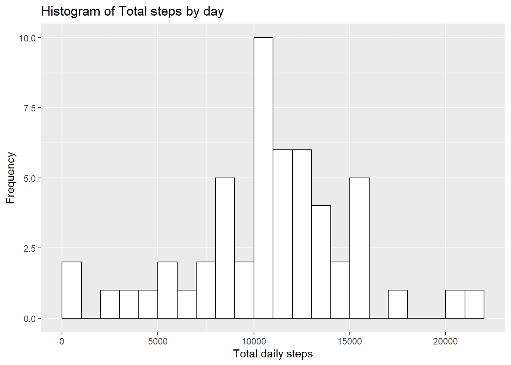
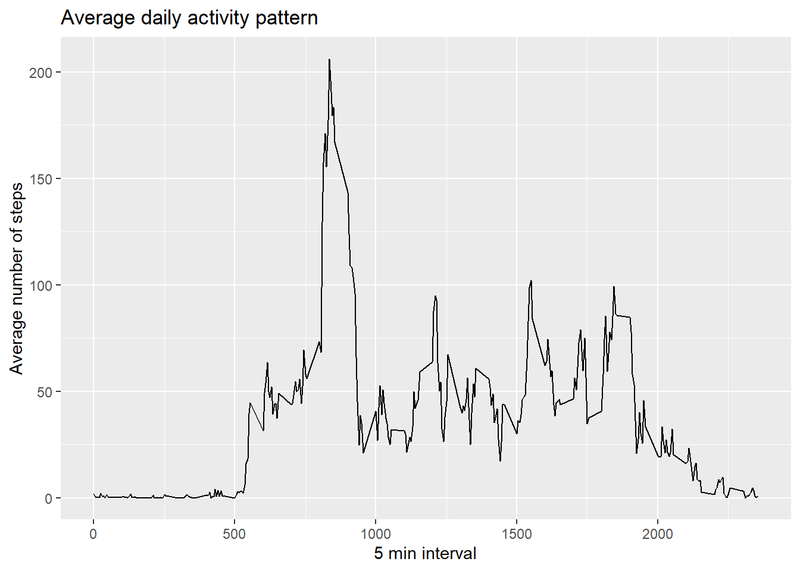
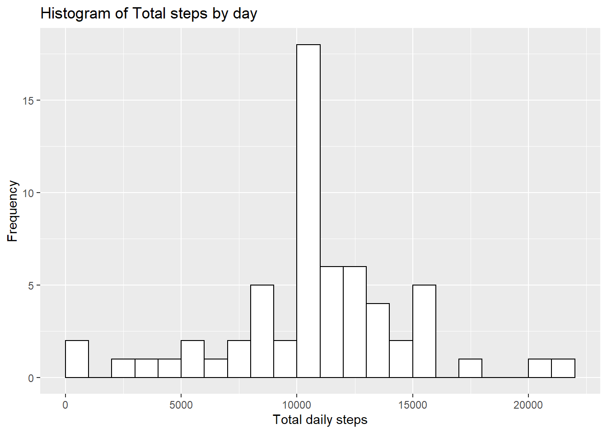
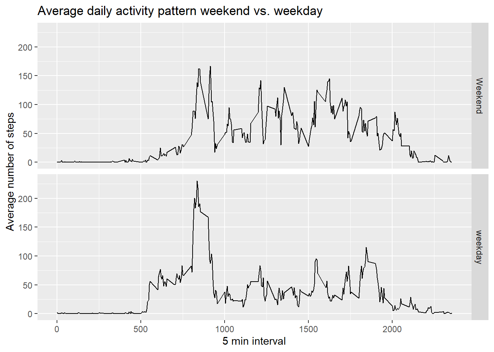

#Introduction

This assignment makes use of data from a personal activity monitoring device. This device collects data at 5 minute intervals through out the day. The data consists of two months of data from an anonymous individual collected during the months of October and November, 2012 and include the number of steps taken in 5 minute intervals each day.

##Data
Data is available from the [GitHub Reprository](https://github.com/rdpeng/RepData_PeerAssessment1)
The variables included in this dataset are:

- *steps*: Number of steps taking in a 5-minute interval (missing values are coded as NA)

- *date*: The date on which the measurement was taken in YYYY-MM-DD format

- *interval*: Identifier for the 5-minute interval in which measurement was taken

The dataset is stored in a comma-separated-value (CSV) file and there are a total of 17,568 observations in this dataset.

##Loading and preprocessing data
Unzipping the activity dataset and reading the dataset into dataset activity. I am also cheking the data by looking at the first few lines.

```r
unzip("activity.zip")
activity <- read.csv("activity.csv")
head(activity)
```

```
##   steps       date interval
## 1    NA 2012-10-01        0
## 2    NA 2012-10-01        5
## 3    NA 2012-10-01       10
## 4    NA 2012-10-01       15
## 5    NA 2012-10-01       20
## 6    NA 2012-10-01       25
```

```r
str(activity)
```

```
## 'data.frame':	17568 obs. of  3 variables:
##  $ steps   : int  NA NA NA NA NA NA NA NA NA NA ...
##  $ date    : Factor w/ 61 levels "2012-10-01","2012-10-02",..: 1 1 1 1 1 1 1 1 1 1 ...
##  $ interval: int  0 5 10 15 20 25 30 35 40 45 ...
```

Loading the needed packages

```r
library(dplyr)
library(lubridate)
library(ggplot2)
library(knitr)
```

Transforming the date into date format and changing the language of the dates to English

```r
activity$date <- as.Date(parse_date_time(as.character(activity$date), "ymd"))
Sys.setlocale("LC_TIME", "English")
```

```
## [1] "English_United States.1252"
```

##What is mean total number of stapes taken per day
###Make a Histogram of total number of steps taken each day
Ignoring the missing values in variable steps and grouping the dataset by date and suming the total number of steps taken per day. Following by a histogram of total steps by day

```r
rmna_activtiy <- activity[!is.na(activity$steps),]
Activity_by_date <- rmna_activtiy %>% group_by(date) %>% summarise(Sum_Steps = sum(steps))
ggplot(Activity_by_date, aes(x=Sum_Steps)) + geom_histogram(binwidth = 1000, boundary=0, fill="white", colour = "black") + ggtitle("Histogram of Total steps by day") + xlab("Total daily steps") + ylab("Frequency")
```



###Calculate and report the mean and median total number of steps taken per day

```r
Mean_Steps <- mean(Activity_by_date$Sum_Steps)
print(paste("The mean is: ", Mean_Steps))
```

```
## [1] "The mean is:  10766.1886792453"
```

```r
Median_Steps <- median(Activity_by_date$Sum_Steps)
print(paste("The median is: ", Median_Steps))
```

```
## [1] "The median is:  10765"
```

## What is the average daily activity pattern
###Make a time series plot (i.e. type = "l") of the 5-minute interval (x-axis) and the average number of steps taken, averaged across all days (y-axis)
Grouping the dataset with no NA by ineterval and calculating the average steps and then creating a plot (type = "l")

```r
activity_by_interval <- rmna_activtiy %>% group_by(interval) %>% summarise(Average_Steps = mean(steps))
ggplot(activity_by_interval, aes(x = interval, y = Average_Steps)) + geom_line() + ggtitle("Average daily activity pattern") + xlab("5 min interval") + ylab("Average number of steps")
```



###Which 5-minute interval, on average across all the days in the dataset, contains the maximum number of steps?


```r
max_steps <- activity_by_interval[which(activity_by_interval$Average_Steps == max(activity_by_interval$Average_Steps)), 1]  
print(paste("Interval containing the most steps on average: ", max_steps))
```

```
## [1] "Interval containing the most steps on average:  835"
```

##Imputing missing values
###Calculate and report the total number of missing values in the dataset (i.e. the total number of rows with NAs)


```r
sum_na <- sum(is.na(activity$steps)) + sum(is.na(activity$interval)) + sum(is.na(activity$date))
print(paste("The toal number of missing values: ", sum_na))
```

```
## [1] "The toal number of missing values:  2304"
```

###Filling in all missing values with the mean for that 5 minute interval and creating a new dataset activity_impute with the missing data filed in.


```r
activity_impute <- activity %>% group_by(interval) %>% mutate(steps = ifelse(is.na(steps), mean(steps, na.rm=TRUE), steps))
```

###Make a histogram of the total number of steps taken each day and Calculate and report the mean and median total number of steps taken per day. 
Making the histogram

```r
Activity_impute_by_date <- activity_impute %>% group_by(date) %>% summarise(Sum_Steps = sum(steps))
ggplot(Activity_impute_by_date, aes(x=Sum_Steps)) + geom_histogram(binwidth = 1000, boundary=0, fill="white", colour = "black") + ggtitle("Histogram of Total steps by day") + xlab("Total daily steps") + ylab("Frequency")
```



Calculating and reporting the mean and the median with the imputed data


```r
Mean_Steps_imp <- mean(Activity_impute_by_date$Sum_Steps)
print(paste("The mean is: ", Mean_Steps_imp))
```

```
## [1] "The mean is:  10766.1886792453"
```

```r
Median_Steps_imp <- median(Activity_impute_by_date$Sum_Steps)
print(paste("The median is: ", Median_Steps_imp))
```

```
## [1] "The median is:  10766.1886792453"
```

The mean value stayed the same and the median value changed a little bit. The impact of imputing missing data is small

##Are there differences in activity pattern between weekdays and weekends
Using the data with the filledin missing values (activity_impute)
###Create a new factor variable in the dataset with two levels  - "weekday" and "weekend" indicating whether a given date is a weekday or weekend day.


```r
weekend <- c("Sunday", "Saturday")
activity_impute <- activity_impute %>% mutate(weekday = factor(weekdays(date) %in% weekend, levels = c(TRUE, FALSE), labels = c("Weekend", "weekday")))
```

###Make a panel plot containing a time series plot (i.e. type = "l") of the 5-minute interval (x-axis) and the average number of steps taken, averaged across all weekday days or weekend days (y-axis).


```r
Activity_impute_by_interval <- activity_impute %>% group_by(interval, weekday) %>% summarise(Average_Steps = mean(steps))
```

```
## `summarise()` has grouped output by 'interval'. You can override using the `.groups` argument.
```

```r
ggplot(Activity_impute_by_interval, aes(x = interval, y = Average_Steps)) + geom_line() + ggtitle("Average daily activity pattern weekend vs. weekday") + xlab("5 min interval") + ylab("Average number of steps") + facet_grid(weekday~.)
```



There are some differences between the activities on weekends and weekdays


